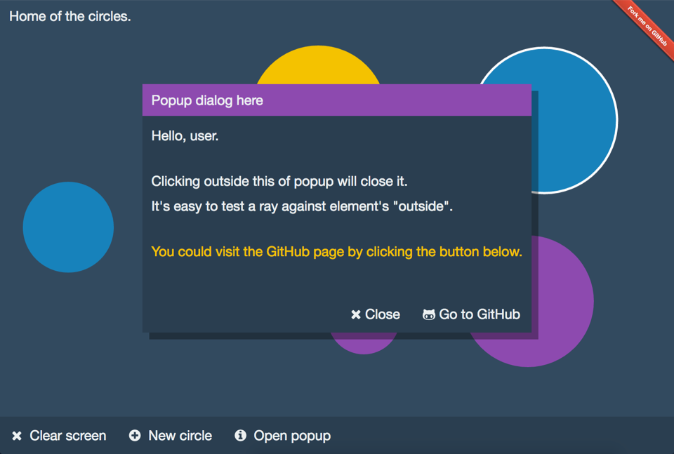

[](https://www.npmjs.com/package/raycast-dom)

[](https://www.npmjs.com/package/raycast-dom)

# Raycast #

*Raycast* is a publish/subscribe event framework based on emitting rays to user interface.
It makes *event bubbling* a first class citizen of modern web application development.

It's based around a simple idea:

A point of contact between user and UI is a glass surface (screen), usually having a single point of contact (single pixel).
Therefore, there MUST be a 1:1 relation between user gestures and application state changes.
This means that all the gestures could be processed at central place.

There are scenarios where scattering event handlers throughout the application is not convenient.
For instance, when building a component having huge number of interactive children (grids, trees, menus).
This is where you may find this framework handy.

[](http://dkozar.github.io/raycast-dom/)

## Javascript libraries and Raycast ##

Raycast is not tied to any of the libraries; it can be used with any web application framework.

Modern web application frameworks (like [React](https://facebook.github.io/react/)) encourage a single point of gesture processing.
This is accomplished by having a (single) store, with application root subscribing to store changes.
The state is being changed by actions, fired by components.

Raycast also encourages this concept.
However, instead using different actions to update the store, we're emitting rays which are being processed by the application root (and other interested parties).
Application becomes just a *view* with single responsibility of rendering itself in different states.
With Raycast, there's no need of components subscribing to events and process them, nor firing any actions.
This leads to much simpler component design and better decoupling.

## Rays ##

Since GUI elements are layered (having a parent-child relationship), *touching* a piece of user interface is - in essence - a 3D concept.
It's much like raycasting in 3D computer games, where fired ray intersects multiple game objects.
Just like with game objects, all the intersections between the Ray and GUI layers are important for gesture analysis.

A single Ray contains all intersection information.
This information is then being processed by subscribers, which are usually located near the application root.
This eliminates the need for having a "chain" of components, where each component in the chain is passing handler references to its children.

## Event bubbling and parent chain ##

In essence, the information provided by Ray is a type of "condensed event bubbling information".
The difference is that, unlike *walking the DOM* both ways (as event bubbling does) and triggering event handlers on elements, all Ray intersections are passed to subscriber(s) at once.
Subscriber then makes sense of Ray information by analyzing it.

Personally, I became aware of the importance of event-bubbling information while I was [working on eDriven.Gui](https://github.com/dkozar/edriven-gui/blob/master/eDriven/eDriven.Gui/Util/GuiEventProcessor.cs)
I was recreating the parent chain upon each user interaction (by *walking the DOM*) and this never resulted in any performance degradations.

Back to the browser. When having a reference to DOM element, constructing parent chain is easy.
Browser calculates the parent chain for us, providing parentNode property for each DOM node (each event also provides the *path* property, which holds the parent chain information). 

## Emitter ##

Emitter is a singleton subscribing to *document* and *window* objects.
It's building Rays and dispatching them to interested parties.
Emitter subscription is based on Signals and slots pattern I used [quite a lot with eDriven](https://github.com/dkozar/edriven/blob/master/eDriven.Core/Signals/Signal.cs).
Interested parties connect to emitter passing an object with handler references, that will be fired by Emitter (with Ray as an argument).
This approach is handy because connect/disconnect methods are called once per subscriber (passing all handlers at once).

## Plugs ##

Plugs are custom emitters, built by component or application developers, and then plugged into Emitter.
They are converting *raw* Emitter events to something more meaningful to particular components.
The idea behind this is that there should be no duplicated work (converting browser events to rays).
While I was working on [react-data-menu](https://github.com/dkozar/react-data-menu), I became aware that not only menu component is interested in menu events.
That's why it's handy to have a source of *converted* events being accessible and reused by interested parties.
I've been already using the concept of [parent/slave dispatchers](https://github.com/dkozar/edriven/blob/master/eDriven.Core/Managers/SystemManager.cs), which turned out to be very practical.

## Storeless/actionless applications ##

With Raycast, it is possible to create an application having no store nor actions.
However, having all the code in application root would make our application unmaintainable.
That's why I suggest decoupling ray processors from application root.
For this, you can use composition, having *processor* objects referencing the application component.

Note: Since Raycast demos are tiny, I'll keep ray handlers inside the application component for simplicity.

## Raycast Prerequisites: ##

1. Decoration: Each *interactive* element in the application should be decorated with unique ID or className.
   This requires a bit of discipline. I suggest keeping ID prefixes as constants accessible by both rendering classes and Emitter subscribers.

# Raycast pros and cons #

## Pros: ##

1. When component is detached from parent document, the *isAttached* method of Ray returns false.
   Rays "detached" from the document are not emitted.
   This means that our handlers are never called by pieces of UI currently not being on screen.
   This prevents the "component not mounted" type of errors.
   
2. Event bubbling as a concept is hard to grasp, even to top programmers.
   Rays and intersections with GUI layers are much easier to visualise and to code against.
   
3. Moving a piece of UI from one place in the application to another shouldn't change anything from event processing point.
   This means less friction when there are (late) design changes to your application.
   With *classic* React, moving a single button from one place to another means rewriting the handler logic, as well as rewriting tests. 

## Cons: ##

1. Decorating components with IDs.
   When using 3rd party components, it's often not possible to change the way they render.
   With React we could use IDs generated by React (data-reactid), however I found it not to be so clean.

2. Unit testing is not so straightforward if tested component doesn't handle Emitter subscription by itself.
   Integration tests of components having internal Emitter subscription are simple.
   For instance, my [menu system](https://github.com/dkozar/react-data-menu) is internally subscribed to Emitter.
   From the outside this doesn't make any difference compared to *classic* React components.
   
   Tip: When testing the (singleton) Emitter, we might want to spy on its methods.
   
## :tv: Demo

http://dkozar.github.io/raycast-dom/

## :zap: Usage

### Circles example ###

```js
// ES6
import React, { Component } from 'react';
import { Emitter } from 'raycast-dom';

const CIRCLE_ID_PREFIX = 'circle-';

export class App extends Component {

    constructor(props) {
        super(props);
        
        this.state = {
            circles = [],
            selectedCircleIndex: -1
        };

        // Emitter subscription
        Emitter.getInstance().connect({
            onMouseOver: this.onMouseOver,
            onMouseOut: this.onMouseOut
        });
    }
    
    onMouseOver(ray) {
        var circle = ray.intersectsId(CIRCLE_ID_PREFIX),
            circleId, circleIndex;

        if (circle) { // circle mouse over            
            circleId = circle.id;
            circleIndex = parseInt(circleId.split(CIRCLE_ID_PREFIX)[1]);
            this.setState({
                hoveredCircleIndex: circleIndex
            });
        }
    }
    
    onMouseOut(ray) {
        if (ray.intersectsId(CIRCLE_ID_PREFIX)) {
            // circle mouse over
            this.setState({
                hoveredCircleIndex: -1
            });
        }
    }
    
    render() {
        // render circles, each using CIRCLE_ID_PREFIX as ID prefix
        // the circle at index = circleIndex should render in hovered state
    }
}

render(<App />, document.body);
```

### Popup window example ###

```js
// ES6
import React, { Component } from 'react';
import { Emitter } from 'raycast-dom';

const DIALOG_ID = 'dialog',
    OPEN_BUTTON_ID = 'open',
    CANCEL_BUTTON_ID = 'cancel',
    SUBMIT_BUTTON_ID = 'submit';

export class App extends Component {

    constructor(props) {
        super(props);
        
        this.state = {
            dialogVisible: false
        };

        // Emitter subscription
        Emitter.getInstance().connect({
            onMouseDown: this.onMouseDown.bind(this),
            onClick: this.onClick.bind(this)
        });
    }
    
    onMouseDown(ray) {
        if (!ray.intersectsId(DIALOG_ID_PREFIX)) {
            // mouse click outside = cancel dialog
            this.setState({
                dialogVisible: false
            });
        }
    }
    
    onClick(ray) {
        if (ray.intersectsId(OPEN_BUTTON_ID)) {
            this.setState({
                dialogVisible: true
            });
        } else if (ray.intersectsId(CANCEL_BUTTON_ID)) {
            this.setState({
                dialogVisible: false
            });
        } else if (ray.intersectsId(SUBMIT_BUTTON_ID)) {
            // *submit* logic here
            this.setState({
                dialogVisible: false
            });
        }
    }
    
    render() {
        return (
            <Button id={OPEN_BUTTON_ID}>Open dialog</Button>
            {this.state.dialogVisible && (
                 <Dialog id={dialog} >
                     { /* Dialog internals here */ }
                     <Button id={CANCEL_BUTTON_ID}>Cancel</Button>
                     <Button id={SUBMIT_BUTTON_ID}>Submit</Button>
                 </Dialog>
             )}
        );
    }
}

render(<App />, document.body);
```
### More ###

For more examples, please take a look at [react-data-menu](https://github.com/dkozar/react-data-menu), which is consuming this package (and extending EmitterPlug).

## :truck: Installation

### Option A - use it as NPM plugin:

```bash
npm install raycast-dom --save
```

This will install the package into the *node_modules* folder of your project.

### Option B - download the project source:

```bash
git clone https://github.com/dkozar/raycast-dom.git
cd raycast-dom
npm install
```

*npm install* will install all the dependencies (and their dependencies) into the *node_modules* folder.

Then, you should run one of the builds.

## :factory: Builds

### :rocket: Hot-loader development build

```bash
npm start
open http://localhost:3000
```

This will give you the build that will partially update the browser via *webpack* whenever you save the edited source file.

Additionally, it will keep the React component state *intact*.

For more info on React hot-loader, take a look into [this fantastic video](https://www.youtube.com/watch?v=xsSnOQynTHs).

### :helicopter: Demo build

```bash
npm run demo
```
This should build the minified *demo* folder (it's how the [demo](http://dkozar.github.io/raycast-dom/) is built).

```bash
npm run debug
```
This should build the non-minified *demo* folder (for easier debugging).

You could install the http-server for running demo builds in the browser:

```bash
npm install http-server
http-server
```

### :steam_locomotive: Additional builds

```bash
npm run build
```

Runs Babel on source files (converting ES6 and React to JS) and puts them into the *build* folder.

```bash
npm run dist
```

Builds the webpackUniversalModuleDefinition and puts it into the *dist* folder.

```bash
npm run all
```

Runs all the builds: *build* + *dist* + *demo*.

```bash
npm run test
```

Runs the tests.

## :thumbsup: Thanks to:

:rocket: [React Transform Boilerplate](https://github.com/gaearon/react-transform-boilerplate) for the workflow.

[](https://www.npmjs.com/package/raycast-dom)